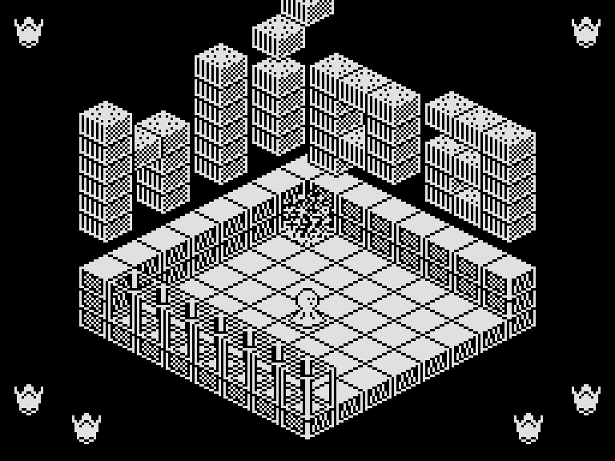

# Hlípa pro ZX Spectrum 48K

První hratelný nativní převod Hlípy od **KASUHA SOFTWARE** — Karla Šuhajdy
a Tomáše Švece. Zachovává herní logiku, grafiku a mapová data přiložené PMD verze.
Na Z80 běží přímo rekonstruovaný a přemístěný strojový kód s novou obsluhou
obrazovky, klávesnice a přerušení pro Spectrum. Není to emulátor PMD.



## Spuštění

- **[output_zx/HLIPA.sna](output_zx/HLIPA.sna)**: otevřít jako snapshot
  v emulátoru nastaveném na ZX Spectrum **48K**.
- **[output_zx/HLIPA.tap](output_zx/HLIPA.tap)**: připojit jako pásku,
  na 48K zadat `LOAD ""` a spustit přehrávání. Na původním Spectru 128K
  lze rovnou zvolit **Tape Loader** v úvodním menu. Hra se spustí automaticky.

TAP během načítání zobrazí dodaný [úvodní obrázek](docs/nahravaci-obrazek-zx.png).
Po načtení se otevře menu. Kresba je vystředěna a mírně zmenšena pro rozlišení
256 × 192; během načítání ji nepřepisují názvy dalších bloků pásky.

Použijte standardní ROM a běžnou rychlost zvoleného modelu. Hra využívá pouze
48K paměti, přídavná paměť ani AY nejsou potřeba. Hotové soubory nevyžadují
instalaci vývojových nástrojů. Modely +2 a +3 zatím samostatně ověřeny nebyly.

## Ovládání

| Klávesa | Páčka Kempstonu | Pohyb / akce |
|---|---|---|
| `0` nebo `Enter` | — | Start; po konci návrat k nové hře |
| `Q` / `7` | Nahoru | Vlevo nahoru |
| `A` / `6` | Dolů | Vpravo dolů |
| `O` / `5` | Vlevo | Vlevo dolů |
| `P` / `8` | Vpravo | Vpravo nahoru |
| `1` | — | Návrat do menu; rozehraná hra se zruší |
| `J` v menu | — | Zapnutí/vypnutí rozhraní Kempston |

Kempston je po načtení vypnutý. Výslovné zapnutí
brání tomu, aby se hodnoty nepřipojeného portu vykládaly jako pohyb.

Cílem je zničit šest Ploxonů, připomínajících korunky. Hlípa se jich dotkne
hlavou. Falmonům se vyhýbejte: dotyk ubírá sílu. Kanály přenášejí Hlípu
mezi místnostmi.
Šest původních korunek je rozmístěno u vnějších okrajů obrazovky: po jedné
v horních rozích a po dvou v dolních. Sebranou korunku obklopí paprsky podle PMD verze. Vítězná obrazovka obsahuje původní blahopřání
z přiloženého obrázku a všech šest korunek s paprsky označujícími sebrání.
Menu a závěrečné texty používají českou
diakritiku z vlastního 768bajtového fontu s 15 českými verzálkami.
Všechny textové znaky se čtou z tohoto souboru, bitmapy z ROM se nepoužívají.
Hlavní menu uvádí „ATARIBABY 2026“ a u pokynů zobrazuje ikonky Ploxona
a Falmona odvozené z původních herních spritů.
Po prohře se podle `prohra.png` vypíše počet navštívených místností, procento
mapy, počet korunek a původní slovní hodnocení. Údaje se počítají ze hry.

Pro orientaci je k dispozici také přiložená
[obrazová mapa PMD verze od Pavera](assets/pmd85doc_map_hlipa.png)
a [původní návod](assets/pmd85doc_txt_hlipa.txt). Další
[PMD mapa](assets/hlipa_PMD_mapa.png) označuje také nízkou zeď;
[zkratky z komentářů Herního archeologa](docs/ZKRATKY.md) byly v portu ověřeny.

## Rozsah převodu a ověření

Fungují pohyb, kolize, nepřátelé, kanály, cíle, smrt, nová hra a vítězná
obrazovka. Hrací plocha má původních 192 × 192 bodů, uprostřed obrazovky
Spectra, bez zmenšování. V tabulce je zachováno všech 256 záznamů místností.

Nepoužívané PMD rutiny jsou odstraněné a zachovaný kód je uložený bez mezer.
Volná paměť má **1999 bajtů**, z toho **1792 bajtů v jednom bloku**.
TAP má **33789 bajtů**; pracovní paměť si hra připraví až po načtení.

Automatické zkoušky vykonávají skutečný sestavený Z80 program:

- geometrie a kolize všech 256 záznamů souhlasí s PMD referencí;
- 90 snímků pohybu a klidu má shodnou pozici postavy a herní obraz po jednotlivých pixelech
  mimo přesunuté ukazatele korunek;
- prověřeno všech 45 přenosů kanály, kontakt se šesti Ploxony a následné vítězství;
- jednotlivé korunky i stav všech šesti odpovídají grafice PMD v nových rozích;
  po celou cestu k výhře je překreslování místností ani sběr cílů nepřemazává;
- 192 případů rychlého zatočení přes klávesnici a Kempston má jeden tón za dokončený krok;
- ověřeno ovládání, přepínače, smrt, restart, české texty a deset případů
  závěrečných statistik včetně tvarů „místnost“, „místnosti“ a „místností“;
- TAP prošel BASIC/ROM zavaděčem se zrychleným přenosem i čtením páskových
  impulzů; úvodní obrazovka včetně atributů zůstala zachována před načtením
  hlavního kódu i po něm; z TAP i SNA následně naběhlo menu a hra;
- přímé načtení z úvodního menu původního 128K prošlo se skutečnými 128K ROM,
  stránkami RAM a časováním přerušení tohoto modelu, včetně pohybu a restartu;
- při modelování paměťové contention měl test 50 kroků v úvodní místnosti
  průměr **60,303 ms na krok**. Cílová prodleva je tři televizní snímky.

Jde o testy v simulátoru SkoolKit. Na fyzickém Spectru ani v samostatném
grafickém emulátoru zatím tato verze vyzkoušena nebyla. Cílený test šesti
Ploxonů umísťuje postavu k cílům. Navíc už prošel **souvislý průchod od startu
až k výhře pouze klávesami**: všech šest korunek, 94 různých místností,
plná síla 31. Stejný záznam prošel i s modelováním contention.
První tři korunky vycházejí z dodaného návodu, další cesta byla nalezena
samostatně. Podrobnosti jsou v [záznamu průchodu](docs/PRUCHOD_HROU.md).

Původní hudba, hodiny/budík, rolovaný návod a původní grafická podoba koncových
obrazovek zatím převedeny nejsou. Menu a koncové obrazovky mají nové rozložení
s českým písmem. Po dokončení kroku Hlípy zazní krátké pípnutí. Změna směru během animace
nepřidá pípnutí navíc. Samotné zobrazení nové místnosti nepípá; zvuk zazní
až po dokončení dalšího kroku. Během pádu je ticho,
při dopadu pípne jednou. Výkřik smrti zazní hned po dokončení smrtelné animace,
ještě nad herní obrazovkou; teprve potom se zobrazí výsledky hry.

Další náhledy: [menu](docs/menu-zx.png), [sebraná korunka](docs/korunka-zx.png),
[prohra](docs/prohra-zx.png), [vítězství](docs/vyhra-zx.png).

## Sestavení a zdroje

Potřebujete Python 3 a **z88dk-z80asm** z [z88dk](https://github.com/z88dk/z88dk).
Ve Windows spusťte:

```powershell
.\build.bat
```

Případně na libovolném podporovaném systému:

```text
python -B src_zx/build.py
```

Assembler se hledá v `PATH` pod názvem `z80asm` nebo `z88dk-z80asm`; lze také
nastavit proměnnou `Z80ASM` na cestu k němu. Musí jít o assembler z88dk,
nikoli jiný program stejného jména. `build.bat` respektuje také `PYTHON`.
Sestavení funguje bez sítě a znovu vytvoří TAP i SNA z aktuálních ASM zdrojů.

| Soubor | Účel |
|---|---|
| `src_zx/asm/main.asm` | Rozložení paměti, vstup, IM2 |
| `src_zx/asm/game.asm` | Rekonstruovaná původní logika a data, adresy PMD v komentářích |
| `src_zx/asm/spectrum.asm` | Nativní obsluha Spectra |
| `src_zx/data/font_cz.bin` | Upravitelný font 768 bajtů skutečně používaný ve hře |
| `src_zx/asm/czech_font.asm` | Mapování českých písmen na kódy v BIN fontu |
| `src_zx/asm/menu_icons.asm` | Ikonky Ploxona a Falmona pro hlavní menu |
| `src_zx/asm/tape_loader.asm` | Načtení hry přes ROM bez přepsání úvodního obrázku |
| `src_zx/data/loading.scr` | Hotová úvodní obrazovka Spectra, 6912 bajtů |
| `src_zx/data/pmd_removed.json` | Přehled odstraněných částí původního PMD obrazu |
| `src_zx/build.py` | Sestavení, BASIC zavaděč a balení TAP/SNA |
| `src_zx/tools/import_pmd.py` | Jednorázová rekonstrukce z původní pásky |
| `src_zx/tests` | Regrese hry, obrazů, ovládání a načítání |

**Běžné sestavení nespouští importér.** Jeho ruční spuštění přepíše `game.asm`,
a zahodilo by tak pozdější ruční úpravy tohoto souboru.

Font upravujte v [src_zx/data/font_cz.bin](src_zx/data/font_cz.bin).
Běžné sestavení ho přímo vloží do TAP i SNA, bez regenerování z ROM.
[Výstupní BIN pro stažení](output_zx/HLIPA_CZ_FONT.bin) je jeho kopie.
[Přehled mapování a postup úprav](docs/FONT_CZ.md) popisuje nahrazené pozice.

Vývojové testy vyžadují Python 3.11 nebo novější a mají samostatné závislosti:

```text
python -m pip install -r src_zx/tests/requirements.txt
python -B src_zx/tests/verify.py
python -B src_zx/tests/font.py
python -B src_zx/tests/loading.py
python -B src_zx/tests/loading.py --no-fast-load
python -B src_zx/tests/loading.py --machine 128
python -B src_zx/tests/loading.py --machine 128 --no-fast-load
python -B src_zx/tests/replay.py
python -B src_zx/tests/replay.py --contended
python -B src_zx/tests/compaction.py
python -B src_zx/tests/shortcuts.py
python -B src_zx/tests/shortcuts.py --contended
```

Výsledky jsou v `src_zx/build/verification.json` a `loading-verification.json`.
Průchod vytváří také `walkthrough-verification.json` a variantu
`walkthrough-verification-contended.json` ve stejném adresáři.
Zkratky vytvářejí `shortcuts-verification.json` a variantu s `-contended`.
Ověření upraveného BIN fontu zapisuje `font-verification.json`.
Kontrola kompaktního kódu a volné paměti zapisuje `compaction-verification.json`.
Varianta načítání bez přímého nahrání bloků zapisuje `loading-verification-sampled.json`.
Zkoušky modelu 128K přidávají do názvu protokolu `-128`.

Při změně předlohy `assets/nahravaci_obrazek.png` lze pomocí Pillow znovu
vytvořit obrazovku příkazem `python -B src_zx/tools/make_loading_screen.py`.
Běžné sestavení používá uložený `loading.scr` a Pillow nepotřebuje.
ROM použitá testy pochází z instalace SkoolKitu; do distribuce hry se nekopíruje.
Další podrobnosti uvádí [technické poznámky](docs/TECHNICKE_POZNAMKY.md).

Podklady v `assets` pocházejí z uživatelem dodaných verzí hry. Originální autorství
zůstává zachováno; tento projekt nepřiděluje původní hře novou licenci.
