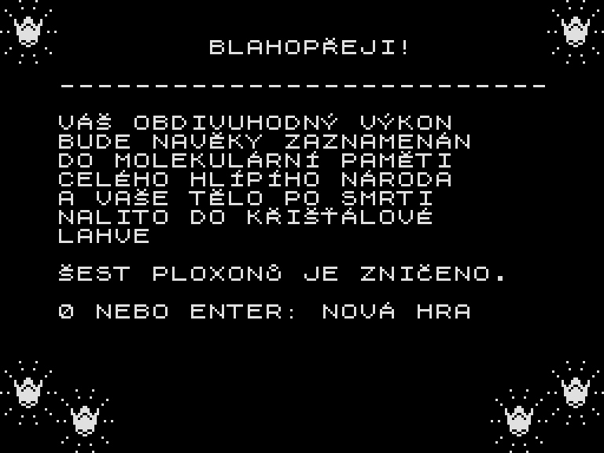

# Ověřený průchod Hlípy

20. září 2026 se podařilo odehrát port od startu až k vítězné obrazovce.
Hlípa získala všech šest korunek, navštívila 94 různých místností a po celou
úspěšnou cestu měla plnou sílu 31. Kód hry ani její mapa se kvůli průchodu
neměnily.



## Dodaný návod

[Text Bat software z roku 1991](../assets/pmd85doc_txt_hlipa.txt) popisuje
cestu ke všem šesti korunkám. Neúplné jsou především doprovodné mapky;
u posledních tří korunek je autor výslovně vynechává.

První tři korunky byly získány podle tohoto návodu. Jeho směry se na Spectru
překládají takto:

| Směr v návodu | Klávesa | Směr na obrazovce |
|---|---|---|
| sever | Q | vlevo nahoru |
| jih | A | vpravo dolů |
| východ | P | vpravo nahoru |
| západ | O | vlevo dolů |

Důležitá upřesnění při hraní:

- U první korunky je třeba správně odbočit na skrytém schodišti. Pouhé
  pokračování rovně může Hlípu dostat pod vyšší stupeň, odkud nevystoupí.
- Ke druhé korunce vede jižnější ze dvou východních průchodů. Severnější
  vede rovnou ke kanálu. Po získání korunky je potřeba vrátit se do vedlejší
  místnosti a dojít k tomuto druhému průchodu.
- Ke třetí korunce je v místnosti 93 potřeba jižní průchod po horní lávce.
  V místnosti 252 pak seskočit na prostřední spodní cestu a pokračovat na jih.
- Korunka se nepřičte hned při příchodu pod ni. Je třeba chvíli zůstat stát
  a nechat Hlípu dotknout se jí hlavou. Také po pádu a kanálu musí odeznít
  omráčení; v tomto stavu hra pohybové klávesy ještě nepřijímá.

U delšího postupu ke čtvrté korunce se nepodařilo jednoznačně přiřadit
všechny pokyny ke konkrétním lávkám a pádům mezi patry. Zbylé tři cíle byly
proto dosaženy jinou cestou nalezenou podle skutečné mapy a ověřenou během
hry. Výsledek dokládá dohratelnost převodu, nikoli přesné ověření každé věty
historického návodu. Některé části nalezené cesty využívají horní okraje zdí.

## Milníky úspěšného záznamu

Čísla místností jsou interní indexy mapy používané v záznamu průchodu.
Aktualizace není jeden krok postavy ani jeden televizní snímek: pohybová
animace trvá více aktualizací.

| Získaná korunka | Místnost | Herní aktualizace | Zbývající síla |
|---|---:|---:|---:|
| 1 | 18 | 486 | 31 |
| 2 | 99 | 1670 | 31 |
| 3 | 70 | 2874 | 31 |
| 4 | 19 | 3728 | 31 |
| 5 | 189 | 4625 | 31 |
| 6 | 171 | 6267 | 31 |

Přehrání zabere přibližně **7 minut 9 sekund herního času** při modelování
contention paměti Spectra. Čas hledání cesty a neúspěšné pokusy v něm nejsou.

## Jak bylo ověření provedeno

Při hledání cesty se používaly uložené stavy a návraty před neúspěšné pokusy.
Všechny úspěšné úseky vznikly ovládáním skutečného sestaveného Z80 programu.
Rozbor kolizí v oddělené pracovní paměti sloužil jen k návrhům cesty; ty se
následně zkoušely klávesami. Neúspěšné odhady byly vyřazeny.

Hotová posloupnost kláves byla potom přehrána **znovu od čistého startu,
bez návratů do uložených stavů a bez zásahů do polohy, energie nebo korunek**.
Tento samostatný test kontroluje všech šest milníků, sílu po každé aktualizaci
a text skutečně vykreslené vítězné obrazovky. Prošel s contention i bez ní.
Jde o běh v simulátoru SkoolKit, nikoli o test na fyzickém Spectru.

Přehrání po sestavení hry:

```text
python -B src_zx/tests/replay.py
python -B src_zx/tests/replay.py --contended
```

Záznam kláves je v [walkthrough.json](../src_zx/tests/data/walkthrough.json).
Výsledné protokoly, celá posloupnost navštívených místností a snímky výhry
vznikají v `src_zx/build`. Záznam platí pro binárku SHA-256
`91b8e49138298a65c3e0cbcffb5512b115413f45c2d51caaf86aead2fe51676d`.
Stejné stisky kláves byly znovu ověřeny i po odstranění PMD rutin, sesunutí kódu
a úpravě zvuků kroků, dopadů a smrti, včetně odstranění prodlevy po smrtelné
animaci, pípnutí navíc při přechodu do nové místnosti a při zatočení
do L. Záznam prošel také po přesunu ukazatelů korunek do vnějších rohů
obrazovky. Samostatně jsou ověřené [čtyři zkratky přes nízkou zeď](ZKRATKY.md).
Po změně hry je třeba ověřit, zda se její chování a záznam stále shodují.

Po úpravě ovládání byly klávesy v záznamu převedeny podle tabulky výše.
Trasa, délky stisků a milníky sběru korunek zůstávají stejné.

Pomocné `walkthrough.py`, `map_routes.py` a `follow_route.py` slouží k hledání
cest a práci s lokálními checkpointy. Statický model zjednodušuje pohyb,
ignoruje nepřátele a sám o sobě není důkazem průchodnosti. Samostatné
`replay.py` žádné z těchto vyhledávacích funkcí nepoužívá.
Staré checkpointy z doby před přesunem kódu nejsou s tímto sestavením kompatibilní.
