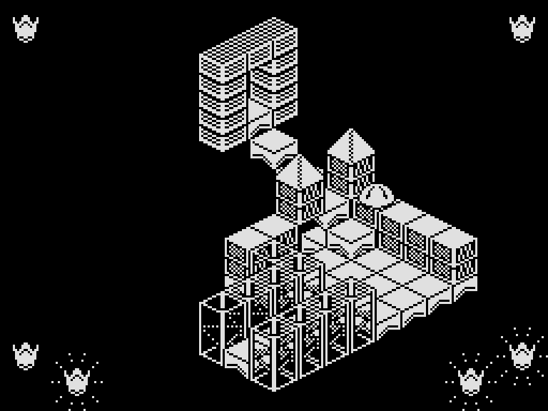
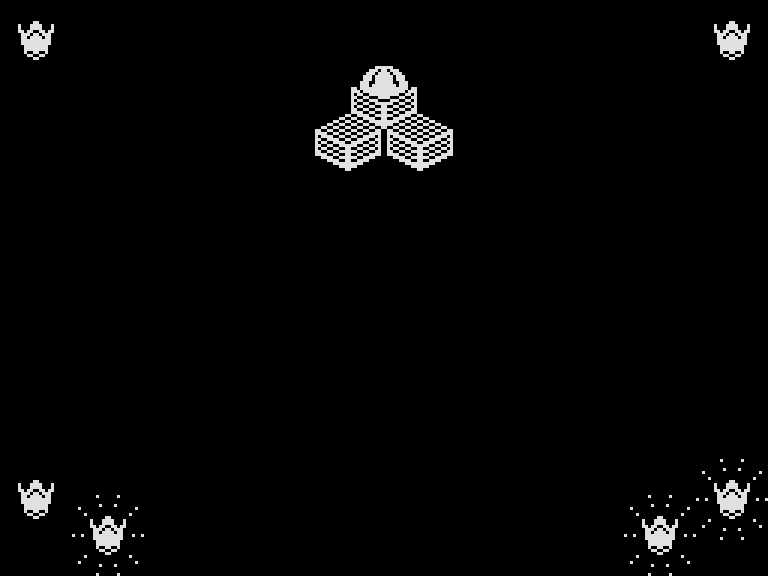

# Zkratky přes nízkou zeď

V portu fungují všechny čtyři trasy popsané v komentářích pod
[článkem Herního archeologa](https://www.herniarcheolog.cz/2019/04/hra-316-hlipa-1989.html).
Každá byla znovu odehrána od startu pouze klávesami, bez přepisování polohy,
energie nebo korunek. Stejný záznam prošel i s modelováním contention v simulátoru
SkoolKit. Nejde o zkoušku v grafickém emulátoru nebo na fyzickém Spectru.

## Výchozí místo

V dodané [PMD mapě](../assets/hlipa_PMD_mapa.png) je ve druhém patře místnost
„Uprostřed schody“ s poznámkou o příliš nízké východní stěně. V datech hry
má číslo **36**. Ze schodů lze vystoupit na východní zeď, na souřadnice
`x=7, y=3, z=4`. Odtud vedou všechny zkoušené cesty.



Směry označují světové strany v mapě: **V = Q, J = P, Z = A, S = O**.
Posloupnosti níže popisují přechody mezi místnostmi, nikoli každý krok postavy.
Uvnitř místnosti je někdy třeba obejít zeď nebo překážku.
Čísla místností jsou interní indexy, které se ve hře nezobrazují.

## Ověřené cesty

| Cesta | Pokyny z komentáře | Dosažené místnosti od nízké zdi |
|---|---|---|
| [Přes úvodní místnost](https://www.herniarcheolog.cz/2019/04/hra-316-hlipa-1989.html#c1579602797414015969) | V J Z S V V, obejít úvodní místnost po zdi, V J J J J Z | 36 → 18 → 178 → 242 → 217 → 11 → 0 → 73 → 139 → 34 → 109 → 231 → 6 |
| [K šesti trubkám](https://www.herniarcheolog.cz/2019/04/hra-316-hlipa-1989.html#c4012241250977984652) | V S V J J V | 36 → 18 → 4 → 146 → 130 → 6 → 1 |
| [Do „Blahopřeji“](https://www.herniarcheolog.cz/2019/04/hra-316-hlipa-1989.html#c8557011393478344846) | V S Z J V S J | 36 → 18 → 4 → 68 → 45 → 13 → 88 → 255 |
| [Na závěrečný stupínek](https://www.herniarcheolog.cz/2019/04/hra-316-hlipa-1989.html#c2108019372581302380) | J V Z V S J Z S J, krok Z a pád, S J, krok V | 36 → 235 → 135 → 169 → 77 → 209 → 157 → 226 → 72 → 233 → 13 → 88 → 255 |

Praktická upřesnění z hraní portu:

- V úvodní místnosti 0 vede první cesta po západní zdi na sever a potom
  po severní zdi na východ, až do jejího rohu. Odtud pokračuje východní přechod.
- U kratší cesty k trubkám je v místnosti 4 nutné pokračovat po západní zdi
  na sever a teprve potom na východ. Přímý pokus o východní přechod po jižním
  okraji skončil pádem ze zdi a smrtí.
- V místnosti 146 se jde po severní zdi do východního rohu a odtud na jih.
  V místnosti 6 se před posledním východním přechodem pokračuje po východní
  zdi na `y=3`, aby příchod do místnosti 1 neblokoval vysoký rohový sloup.
- Cesta na stupínek končí po pádu v místnosti 13 na `6,7,12`. Severní a jižní
  přechod vede přes 88 do 255. Poslední krok na východ a krátké dosednutí
  postaví Hlípu na `7,7,9`, na horní blok stupínku.



Všechny úspěšné zkoušky skončily se **třemi korunkami a plnou energií**.
Samotný vstup do místnosti 255 ani postavení na stupínek v portu nevyhlásí
vítězství: nová vítězná obrazovka vyžaduje všech šest korunek. Dostupnost
původní závěrečné místnosti je tedy potvrzená, automatické dokončení hry
touto zkratkou nikoli. Zkouška také nedokládá průchod všemi 256 místnostmi.

## Opakování zkoušky

Záznam [shortcuts.json](../src_zx/tests/data/shortcuts.json) obsahuje společnou
cestu k nízké zdi a čtyři pokračování. Příchod vychází z prvních 3337 aktualizací
již ověřeného úplného průchodu; dalších 13 aktualizací vystoupí na zeď.
Nejde o hledání nejkratší možné cesty od startu.

```text
python -B src_zx/tests/shortcuts.py
python -B src_zx/tests/shortcuts.py --contended
```

Test kontroluje celou posloupnost místností, výslednou polohu, korunky,
energii, pokračující hru a u stupínku také skutečnou oporu pod Hlípinýma nohama.
Protokoly a snímky vznikají v `src_zx/build/shortcuts-verification*.json`
a `src_zx/build/shortcut-*.png`. Mapa ani pravidla pohybu se kvůli zkratkám neměnily.
